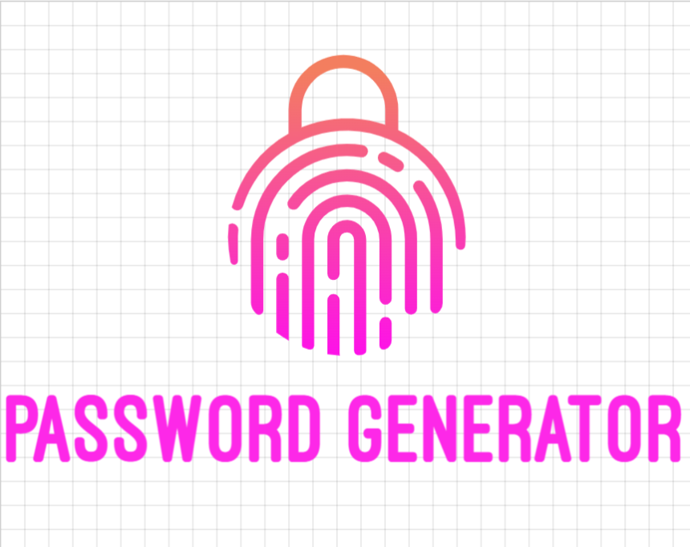
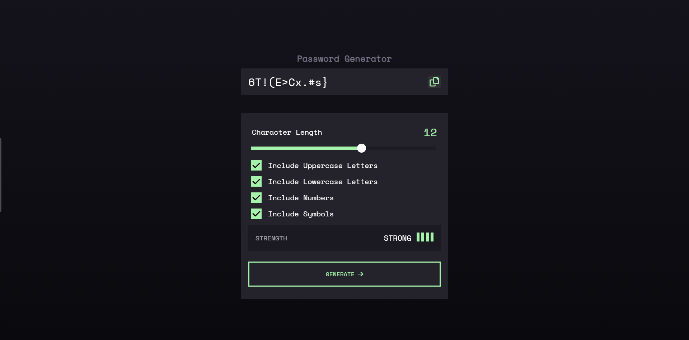

# Password Generator

 

[Password Generator](https://github.com/asit2001/HTML-CSS-Project---HTML-Base-Tags-Meta-Tags-Body-P-tag---Post-Class---hdj4hsgv70e6) is a simple single webpage made with html, css and js. This is a project that I got from Newton School.

## Table of content

- [Feature](#feature)
- [ScreenShort](#screenshort)
- [License](#license)
- [Links](#links)

## Feature

    1. Generate Password include upperCase,lowerCase, numbers and symbols.
    2. Maximum password length is 20 character.
    3. Also displayed generated password strength.
    4. Mobile friendly

## ScreenShort

## License

The Password Generator is licensed under the terms of the MIT Open Source
license and is available for free.

## Links

- [Web site](https://html-css-project-html-base-tags-meta-tags-body-p-q5kc1r6od.vercel.app/)
- [Mobile friendly](https://search.google.com/test/mobile-friendly/result?id=o6Y1NDSrMaE7pWK9DO9p_w)
- [Issue tracker](https://github.com/asit2001/HTML-CSS-Project---HTML-Base-Tags-Meta-Tags-Body-P-tag---Post-Class---hdj4hsgv70e6/issues)
- [Source code](https://github.com/asit2001/HTML-CSS-Project---HTML-Base-Tags-Meta-Tags-Body-P-tag---Post-Class---hdj4hsgv70e6)
